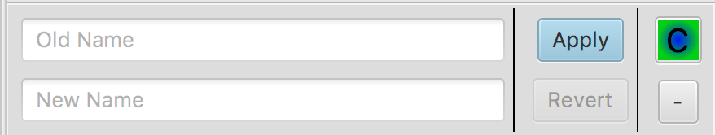

MCPIDE
================
An IDE for writing mappings for MCP.

## Usage
To use MCPIDE, simply download the appropriate release for your platform.

### Main Window
The main window has three parts: the file tree, the editor pane, and the replacements list.

#### File Tree
The file tree contains the current project's files. You can expand folders using the arrow if there are files. There are currently no filters.

#### Editor Pane
The editor pane consists of tabs at the top, which represent the current file in the view. Below the tabs is the contents of the current file, which **cannot** be edited. Replacements from the list have already been applied to the contents of the pane. If any parameters (`p_`), fields (`field_`), or methods (`func_`) are found in the file, they will be colored. When you hover over them, a button will appear allowing you to add a new replacement for it. Tokens that have been replaced are also colored.

#### Replacements List
This is a list of the current replacements. You can search for a replacement, or add a custom one.

Here's an example replacement:

There is two text fields, one for the old name and one for the new name. The `Apply` button will save the replacement and apply it to the open file views. The `Revert` button will revert the old and new names to the previously applied state.

The colorful `C` is the type of replacement. This is used for exporting to MCP commands. There are four types, with their associated commands:

Type     |Letter|Command
---------|------|-------
Custom   |C     |N/A
Field    |F     |`sf`
Method   |M     |`sm`
Parameter|P     |`sp`

The `-` button deletes this replacement, after confirmation. There is no undo!

### Exporting
To export to MCP commands, go to `File > Export > To...`. Once you have exported to a file, it will appear under `File > Export > Recent Places`.

TODO:
- Fix macOS menu being "java" in unbundled versions, dependent on [JDK-8091007](https://bugs.openjdk.java.net/browse/JDK-8091007)
